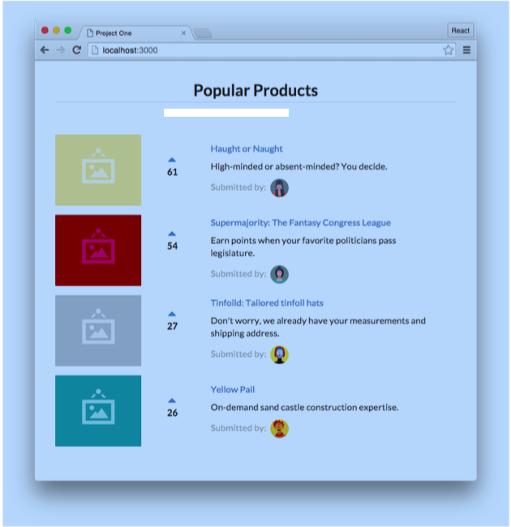

## Sample Code

All the code samples are included with this course. 
Still, we highly recommend implementing the code yourself along with us throughout each section. 
Playing around with examples and sample code will help solidify and strengthen concepts.
Provided with the sample code is a very simple Node.js web server that we’ll be using to run our application.

## Code editor

As you’ll be writing code throughout this course, 
you’ll need to make sure you have a code editor you’re comfortable working with. 
If you don’t already have a preferred editor, we recommend installing Atom4 or Sublime Text5.


## Node.js and NPM


For all the projects in this course, 
we’ll need to make sure we have a working Node.js6 development environment along with NPM.

There are a couple different ways you can install Node.js so please refer to the Node.js website for
detailed information: https://nodejs.org/download/7

> If you’re on a Mac, your best bet is to install Node.js directly from the Node.js website instead of through another package manager (like Homebrew). 
> Installing Node.js via Homebrew is known to cause some issues.


The Node Package Manager (npm for short) is installed as a part of Node.js. 
To check if npm is available as a part of our development environment, we can open a Terminal window and type:

```
$ npm -v
```

If a version number is not printed out and you receive an error, 
make sure to download a Node.js installer that includes npm.


## Browser

Lastly, we highly recommend using the Google Chrome Web Browser8 to develop React apps.
 We’ll use the Chrome developer toolkit throughout this course. 
To follow along with our development and debugging we recommend downloading it now.

## Previewing the application

We’ll be building a basic React app that will allow us to touch on React’s most important concepts at a high-level before diving into them in subsequent sections. 
Let’s begin by taking a look at a working implementation of the app.

Open up the sample code that came with the course, changing to the voting_app/ directory in the terminal:

```
$ cd voting_app/
```

> If you’re not familiar with cd, it stands for “change directory.” If you’re on a Mac, do the
> following to open terminal and change to the proper directory:
    1. Openup/Applications/Utilities/Terminal.app.
    2. Typecd,withouthittingenter.
    3. Tap the spacebar.
    4. IntheFinder,dragthevoting_app/folderontoyourterminalwindow. 5. Hit Enter.
> Your terminal is now in the proper directory.


> Throughout the book, a codeblock starting with a $ signifies a command to be run in your terminal.

> Windows Users: We’ll be using Linux/Mac-style commands on the command line through- out this book. 
> We’d highly recommend installing Cygwin9 as it will let you run commands just as we have printed here.


First, we’ll need to use npm to install all our dependencies:

```
$ npm install
```


With our dependencies installed, we can boot the server using the npm run script server:

```
$ npm run server
```


Heading to our browser, we can view the running application at the URL: http://localhost:300010.



